# URL Shortener — User Handbook

Welcome to the URL Shortener admin panel. This handbook walks you through every feature, step by step.

---

## Table of Contents

1. [Logging In](#1-logging-in)
2. [Dashboard](#2-dashboard)
3. [Viewing All URLs](#3-viewing-all-urls)
4. [Creating a Short URL](#4-creating-a-short-url)
5. [Bulk Creating URLs](#5-bulk-creating-urls)
6. [Editing a URL](#6-editing-a-url)
7. [Downloading a QR Code](#7-downloading-a-qr-code)
8. [Viewing URL Analytics](#8-viewing-url-analytics)
9. [Exporting URLs to CSV](#9-exporting-urls-to-csv)
10. [Logging Out](#10-logging-out)

---

## 1. Logging In

Before using any feature, you must log in with your password.

**Steps:**

1. Open your browser and go to `http://your-domain.com/admin/login`.

   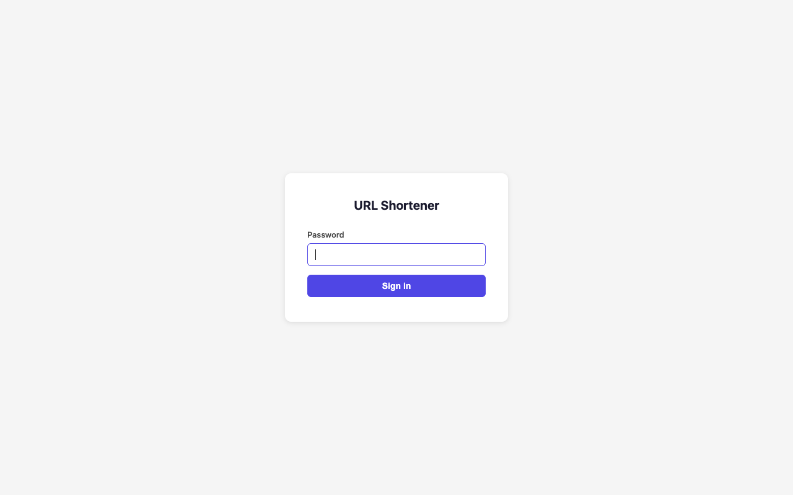

2. Click inside the **Password** field (it is focused automatically).

   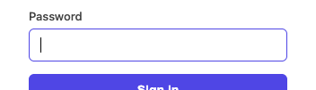

3. Type your admin password.

   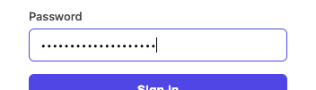

4. Click **Sign in**.

   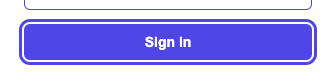

5. You will be taken to the **Dashboard** automatically.

   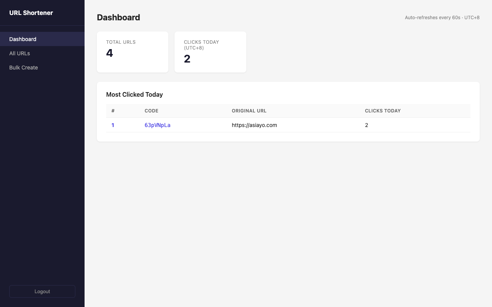

**If the password is wrong**, a red error message appears: *"Invalid password."* Re-enter the correct password and try again.

   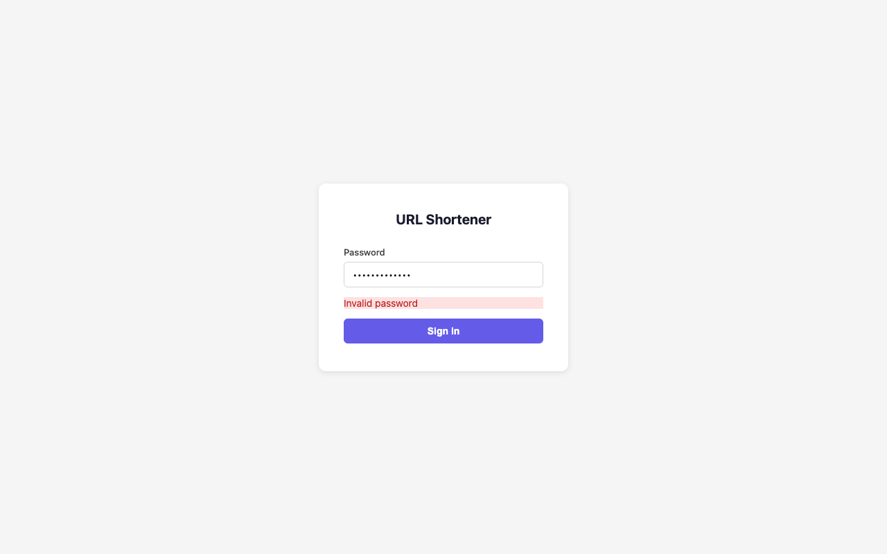

---

## 2. Dashboard

The Dashboard gives you a quick summary of today's activity.

**Steps:**

1. After logging in, you are on the Dashboard. You can also click **Dashboard** in the left sidebar at any time.

   

2. At the top, two summary cards show:
   - **Total URLs** — the total number of short links you have created.
   - **Clicks Today (UTC+8)** — how many times any short link was visited today.

   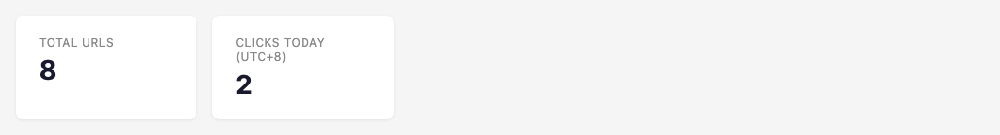

3. Below the cards, the **Most Clicked Today** table lists the short links that received the most visits today, ranked from highest to lowest. Click any **Code** to open that short link in a new tab.

   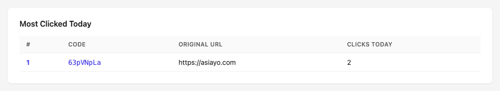

4. The page **refreshes automatically every 60 seconds** — you will see a note at the top right. You do not need to reload the page manually.

   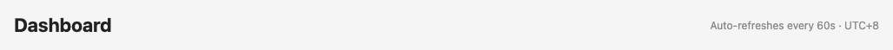

---

## 3. Viewing All URLs

The **All URLs** page shows every short link in the system, with tools to search, sort, and manage them.

**Steps:**

1. Click **All URLs** in the left sidebar.

   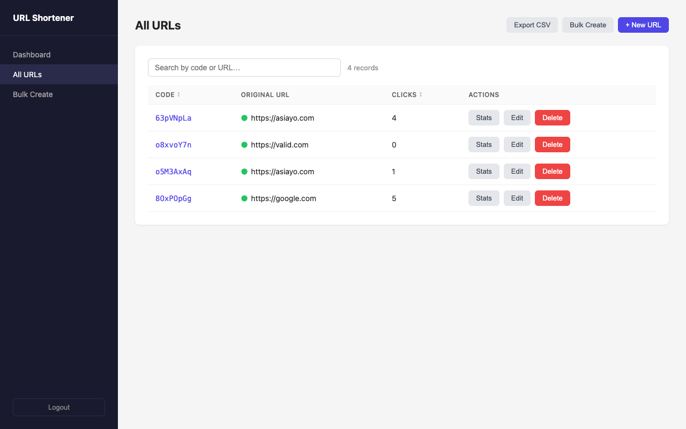

2. The table has these columns:
   - **Code** — the short code (e.g., `abc12345`). A colored dot shows the health of the destination URL: 🟢 green (reachable), 🔴 red (unreachable), ⚪ gray (not yet checked).
   - **Original URL** — the full destination URL.
   - **Clicks** — how many times this link has been visited.
   - **Actions** — buttons to view Stats, Edit, or Delete the link.

   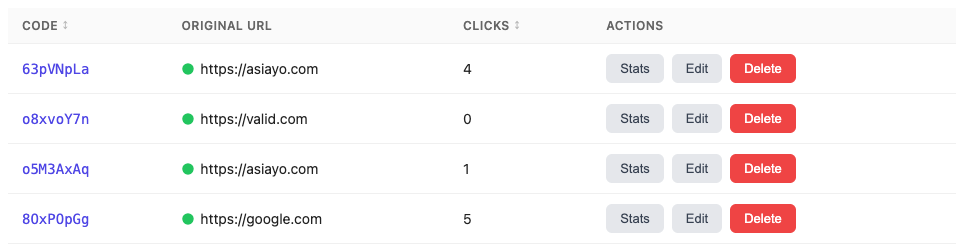

### Searching

3. Type in the **Search** box at the top to filter results by short code or destination URL. Results update as you type.

   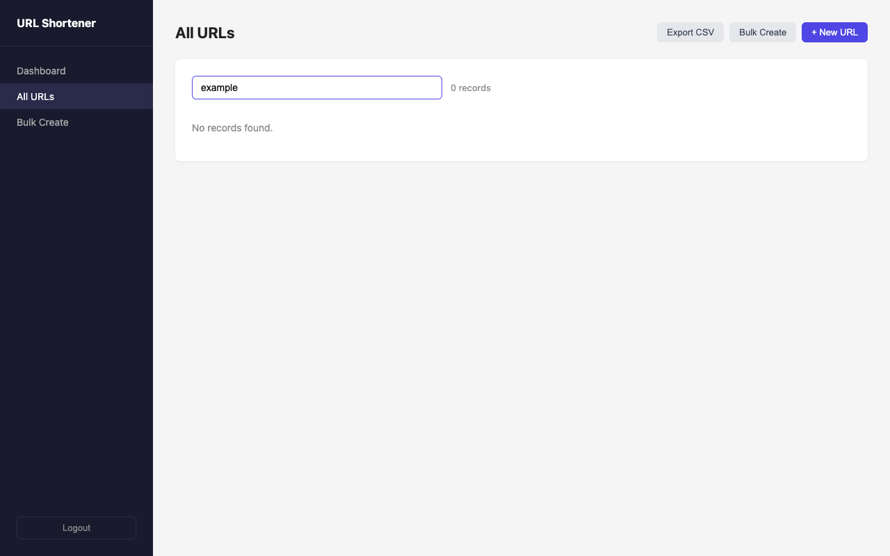

### Sorting

4. Click any **column header** to sort the table by that column. Click once for ascending (↑), click again for descending (↓).

   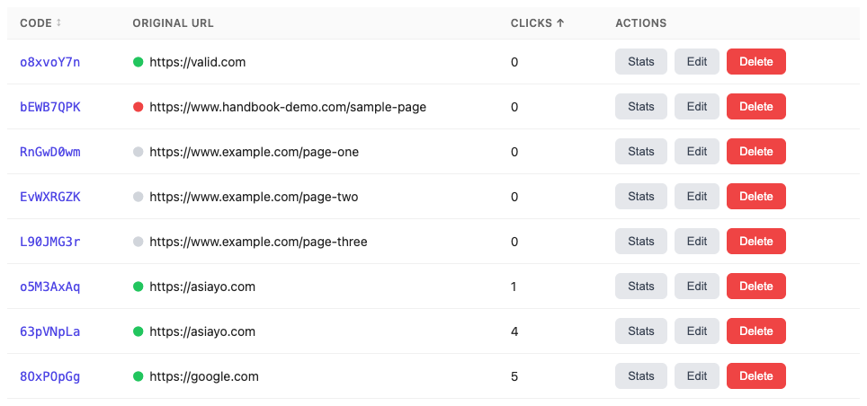

### Pagination

5. If there are more than 25 links, use the **pagination controls** at the bottom to move between pages.

   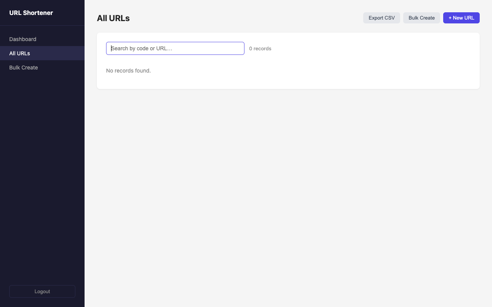

### Action Buttons

6. Each row has three action buttons: **Stats**, **Edit**, and **Delete**.

   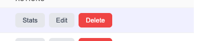

### Deleting a URL

7. Click the red **Delete** button next to a link.

   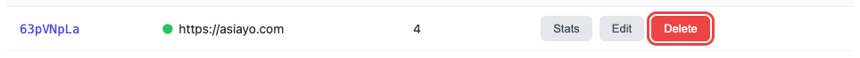

8. A confirmation dialog appears: *"Delete /abc12345?"*. Click **OK** to confirm, or **Cancel** to go back. The link is removed and the table refreshes.

---

## 4. Creating a Short URL

Use this page to shorten a single URL, with an optional custom code and expiry date.

**Steps:**

1. Click **+ New URL** at the top right of the All URLs page.

   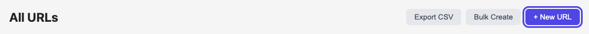

2. The Create URL form opens.

   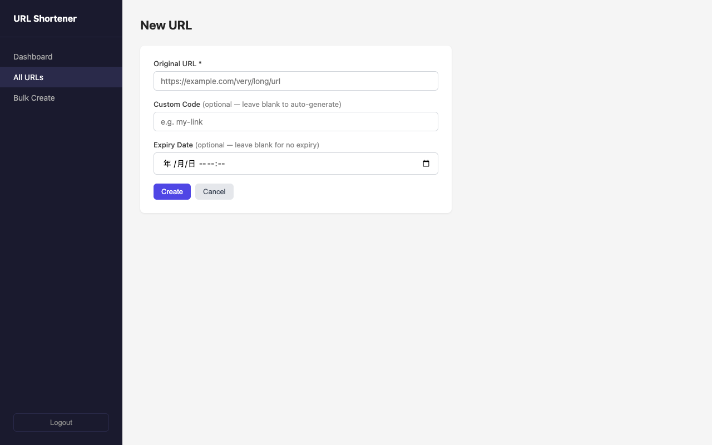

3. In the **Original URL** field, paste or type the full URL you want to shorten. It must start with `http://` or `https://`.

   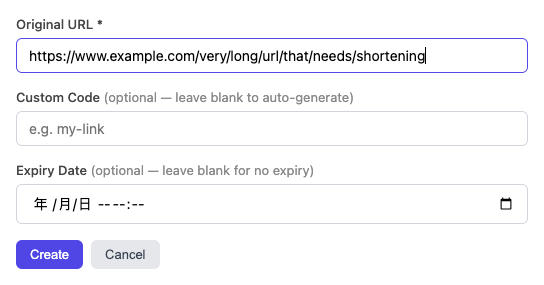

4. *(Optional)* In the **Custom Code** field, type a short code you want to use (e.g., `my-link`). Only letters, numbers, and hyphens are allowed. Leave this blank to have a code generated for you automatically.

   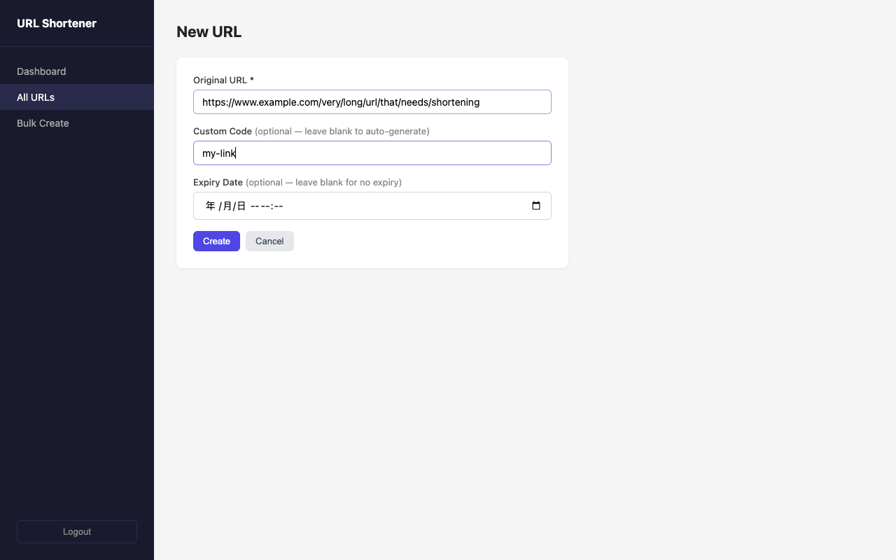

5. *(Optional)* In the **Expiry Date** field, pick a date and time when the link should stop working. Leave it blank if the link should never expire.

   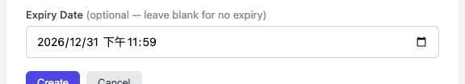

6. Click **Create**.

   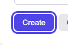

7. You are taken back to the **All URLs** page, where your new short link appears in the list.

   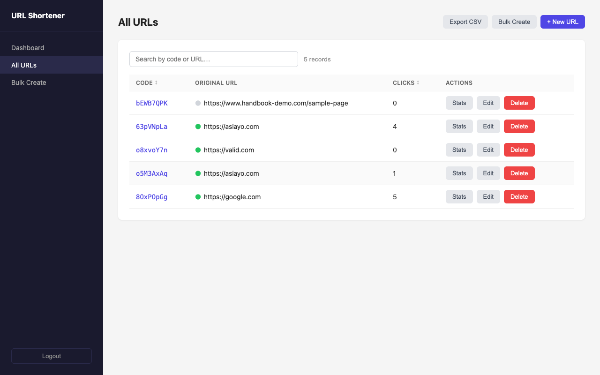

**If something goes wrong**, a red error message appears above the form. Fix the issue and try again.

---

## 5. Bulk Creating URLs

Use this page to shorten many URLs at once — paste a list and they are all created in one click.

**Steps:**

1. Click **Bulk Create** in the left sidebar.

   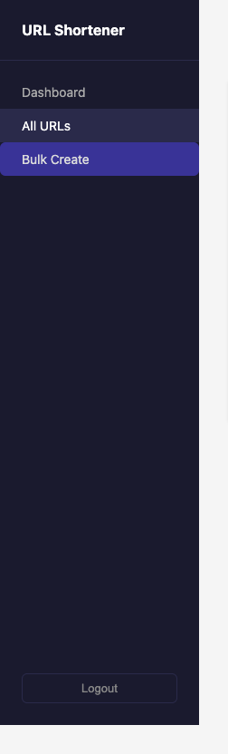

2. The Bulk Create page opens with a large text area.

   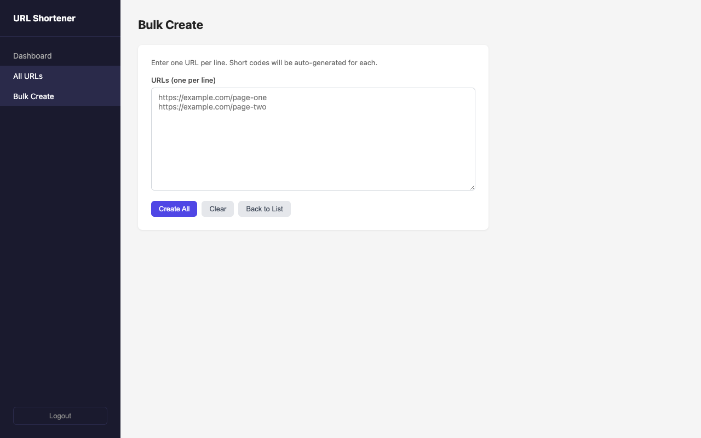

3. In the text area, type or paste your URLs — **one URL per line**.

   ```
   https://example.com/page-one
   https://example.com/page-two
   https://example.com/page-three
   ```

   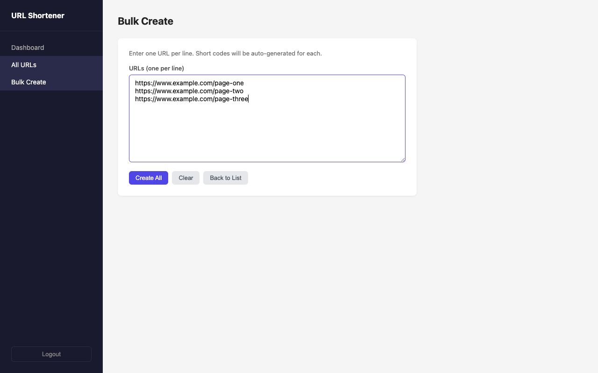

4. Click **Create All**.

   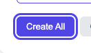

5. A results summary appears showing how many were created successfully and listing any failures.

   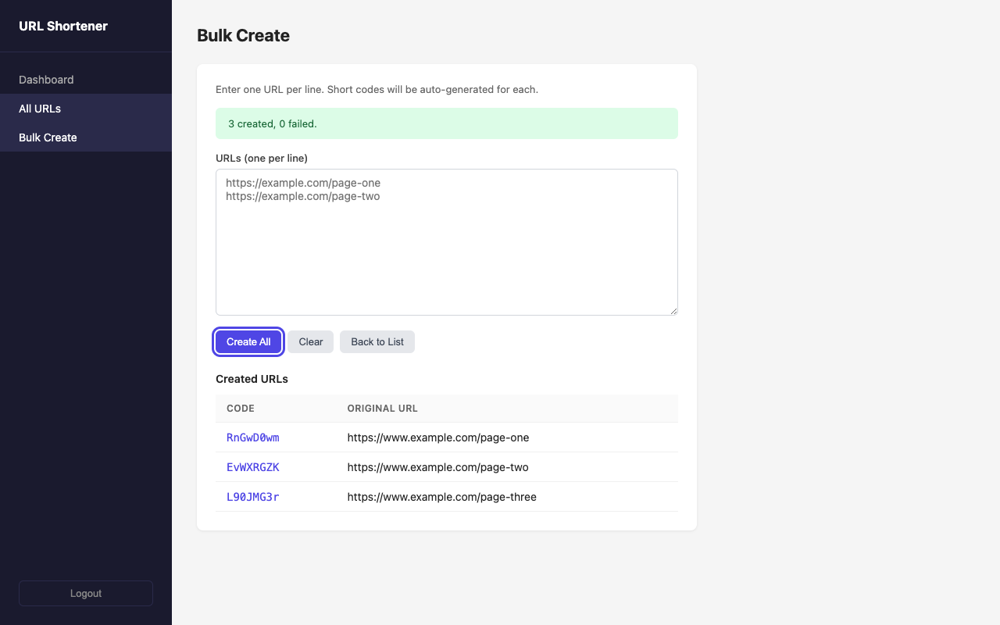

6. A table lists every successfully created link with its new short **Code** and the **Original URL**.

   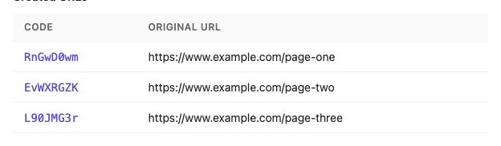

7. To start a new batch, click **Clear** to empty the text area.

   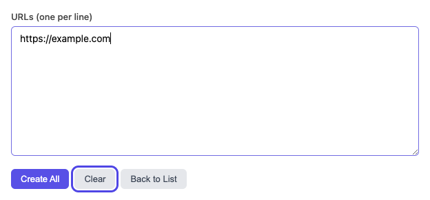

**If a URL in your list is invalid**, it appears in the error list with an explanation. The rest of the valid URLs are still created.

---

## 6. Editing a URL

Change the destination URL, short code, click count, or expiry date of an existing link.

**Steps:**

1. Go to **All URLs** and click the **Edit** button in a link's Actions column.

   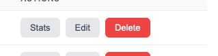

2. The Edit page opens with the current values already filled in.

   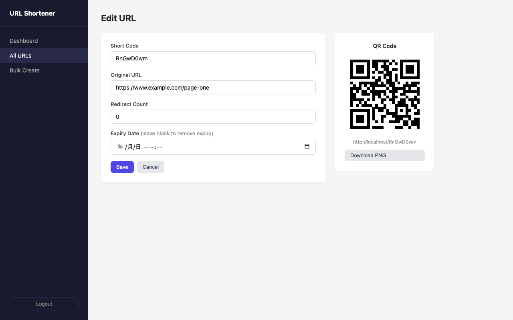

3. Change any of the fields:
   - **Short Code** — the short identifier for the link.
   - **Original URL** — the destination the link points to.
   - **Redirect Count** — the click counter (you can correct this manually if needed).
   - **Expiry Date** — set or remove an expiry. Leave blank to remove the current expiry.

   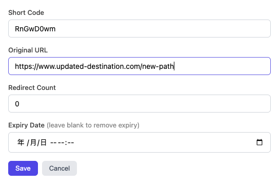

4. Click **Save**.

   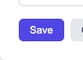

5. You are returned to the **All URLs** page with the changes applied. To cancel without saving, click **Cancel** at any time.

---

## 7. Downloading a QR Code

Every short link has a QR code you can download and share.

**Steps:**

1. Open the Edit page for any link (see Chapter 6, steps 1–2).

   

2. On the right side of the page, the **QR Code** panel shows the QR code for this short link, along with the full short URL below it.

   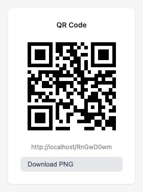

3. Click **Download PNG** to save the QR code image to your computer. The file is saved as `qr-{code}.png`.

   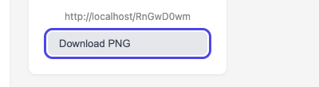

> **Tip:** The QR code updates instantly if you change the Short Code field — you can preview the new code before saving.

---

## 8. Viewing URL Analytics

See detailed click statistics for any short link, including a daily chart, device breakdown, and referrer sources.

**Steps:**

1. Go to **All URLs** and click the **Stats** button in a link's Actions column.

   

2. The Analytics page opens.

   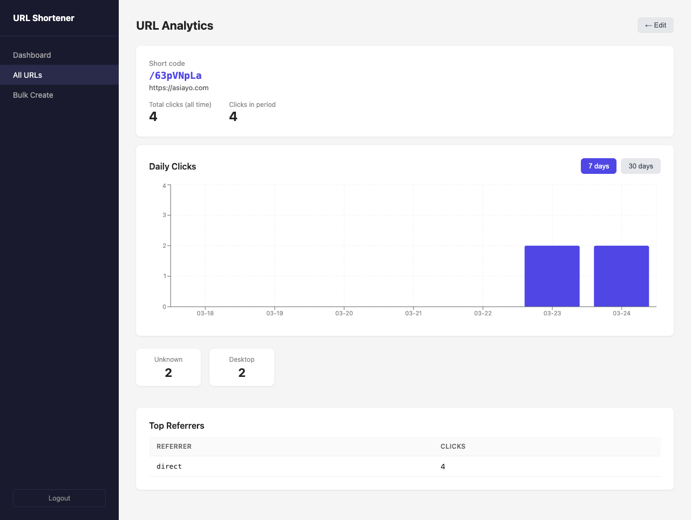

3. At the top, an info card shows the short code, the destination URL, total all-time clicks, and clicks in the selected period.

   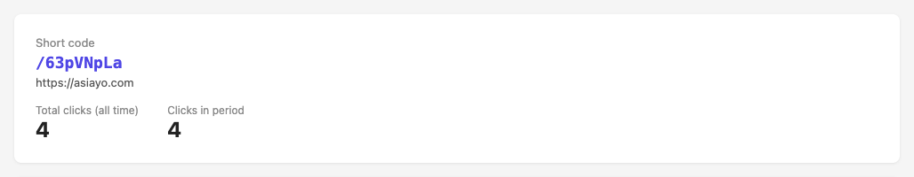

4. The **Daily Clicks** bar chart shows click volume for each day. Hover over any bar to see the exact date and number of clicks.

   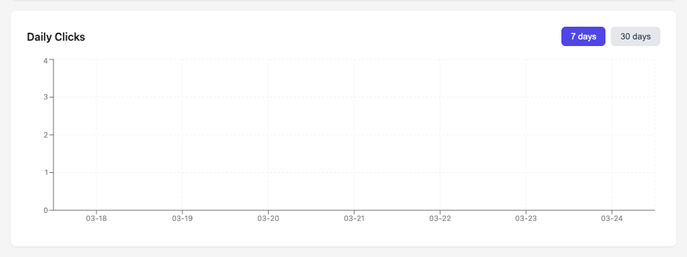

5. Above the chart, choose a time period — **7 days** (default) or **30 days**.

   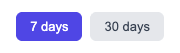

   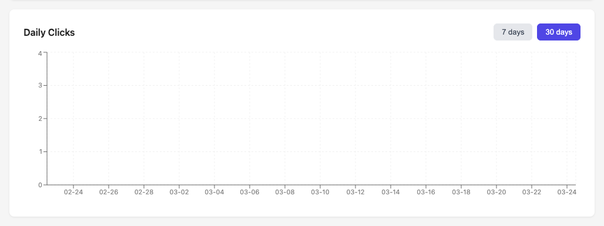

6. Below the chart, the **Device Breakdown** shows how many clicks came from each device type (Mobile, Desktop, Tablet, etc.).

   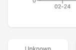

7. The **Top Referrers** table shows which websites or sources sent visitors to your short link.

   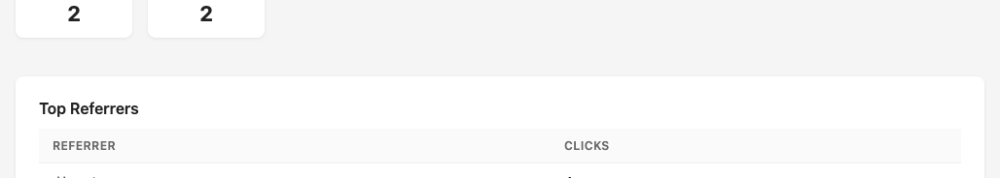

8. To go back, click **← Edit** at the top of the page.

---

## 9. Exporting URLs to CSV

Download a spreadsheet of all your short links for backup or analysis.

**Steps:**

1. Go to **All URLs**.

2. Click the **Export CSV** button at the top right of the page.

   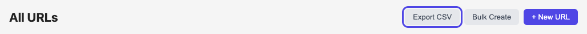

3. Your browser downloads a CSV file automatically. Open it in any spreadsheet application (Excel, Google Sheets, Numbers, etc.).

The CSV includes all short links and their details — regardless of your current search filter.

---

## 10. Logging Out

**Steps:**

1. Click the **Logout** button at the bottom of the left sidebar.

   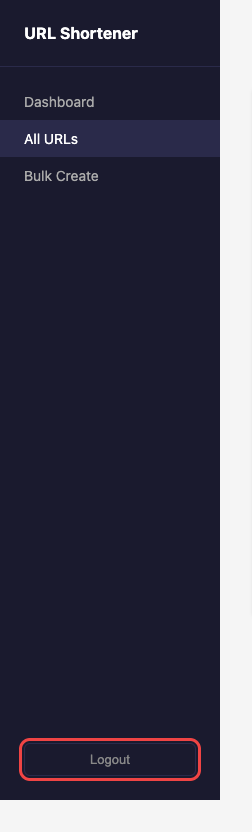

2. You are returned to the login page. Your session is ended.

   

---

*For technical issues, contact your system administrator.*
